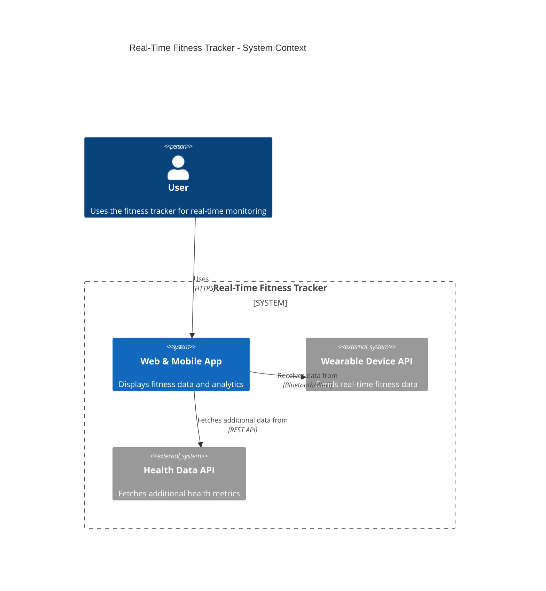
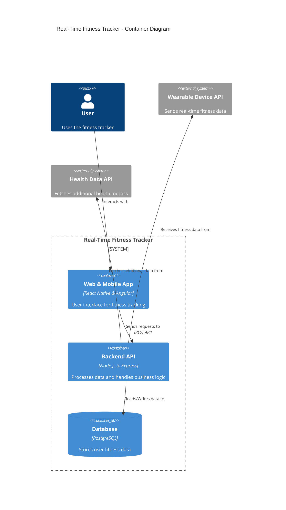
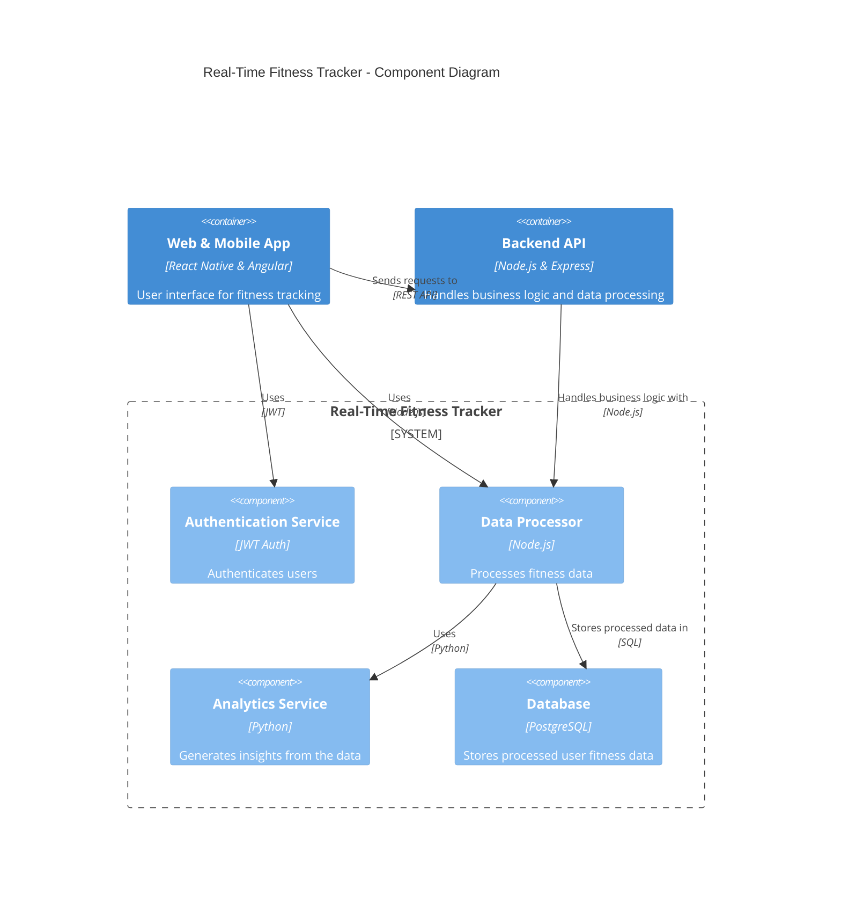
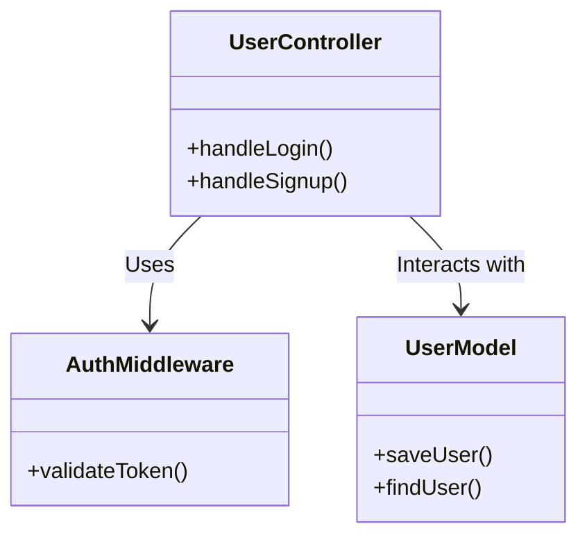

# Architecture Overview

## 1. System Context Diagram (Level 1)

```mermaid
C4Context
    title Real-Time Fitness Tracker - System Context
    Person(user, "User", "Uses the fitness tracker for real-time monitoring")
    System_Boundary(fitnessTracker, "Real-Time Fitness Tracker") {
        System(webApp, "Web & Mobile App", "Displays fitness data and analytics")
        System_Ext(deviceAPI, "Wearable Device API", "Sends real-time fitness data")
        System_Ext(thirdPartyAPI, "Health Data API", "Fetches additional health metrics")
    }
    Rel(user, webApp, "Uses", "HTTPS")
    Rel(webApp, deviceAPI, "Receives data from", "Bluetooth/Wi-Fi")
    Rel(webApp, thirdPartyAPI, "Fetches additional data from", "REST API")
```

## 2. Container Diagram (Level 2)

```mermaid
C4Container
    title Real-Time Fitness Tracker - Container Diagram
    Person(user, "User", "Uses the fitness tracker")
    System_Boundary(fitnessTracker, "Real-Time Fitness Tracker") {
        Container(webApp, "Web & Mobile App", "React Native & Angular", "User interface for fitness tracking")
        Container(api, "Backend API", "Node.js & Express", "Processes data and handles business logic")
        ContainerDb(database, "Database", "PostgreSQL", "Stores user fitness data")
    }
    System_Ext(deviceAPI, "Wearable Device API", "Sends real-time fitness data")
    System_Ext(thirdPartyAPI, "Health Data API", "Fetches additional health metrics")
    
    Rel(user, webApp, "Interacts with")
    Rel(webApp, api, "Sends requests to", "REST API")
    Rel(api, database, "Reads/Writes data to")
    Rel(api, deviceAPI, "Receives fitness data from")
    Rel(api, thirdPartyAPI, "Fetches additional data from")
```

## 3. Component Diagram (Level 3)

```mermaid
    C4Component
        title Real-Time Fitness Tracker - Component Diagram
        Container(webApp, "Web & Mobile App", "React Native & Angular", "User interface for fitness tracking")
    System_Boundary(fitnessTracker, "Real-Time Fitness Tracker"){
        Component(authService, "Authentication Service", "JWT Auth", "Authenticates users")
        Component(dataProcessor, "Data Processor", "Node.js", "Processes fitness data")
        Component(analyticsService, "Analytics Service", "Python", "Generates insights from the data")
    }
    Container(api, "Backend API", "Node.js & Express", "Handles business logic and data processing")
    System_Boundary(fitnessTracker, "Real-Time Fitness Tracker"){
    Component(database, "Database", "PostgreSQL", "Stores processed user fitness data")
    }
    
    Rel(webApp, authService, "Uses", "JWT")
    Rel(webApp, dataProcessor, "Uses", "Node.js")
    Rel(dataProcessor, analyticsService, "Uses", "Python")
    Rel(dataProcessor, database, "Stores processed data in", "SQL")
    Rel(webApp, api, "Sends requests to", "REST API")
    Rel(api, dataProcessor, "Handles business logic with", "Node.js")

```

## 4. Code Diagram (Level 4)

```mermaid
classDiagram
    class UserController {
        +handleLogin()
        +handleSignup()
    }
    class AuthMiddleware {
        +validateToken()
    }
    class UserModel {
        +saveUser()
        +findUser()
    }
    UserController --> AuthMiddleware : Uses
    UserController --> UserModel : Interacts with
```

