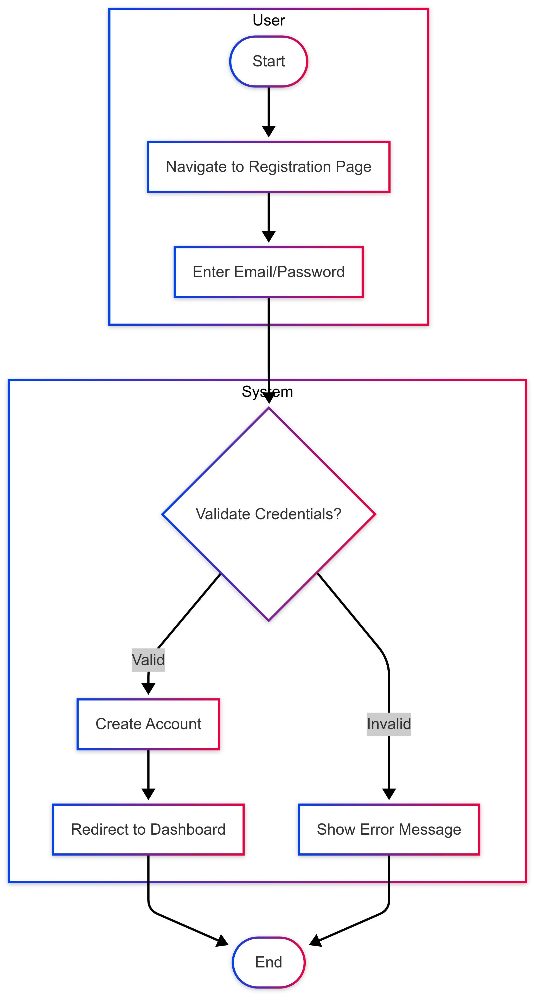
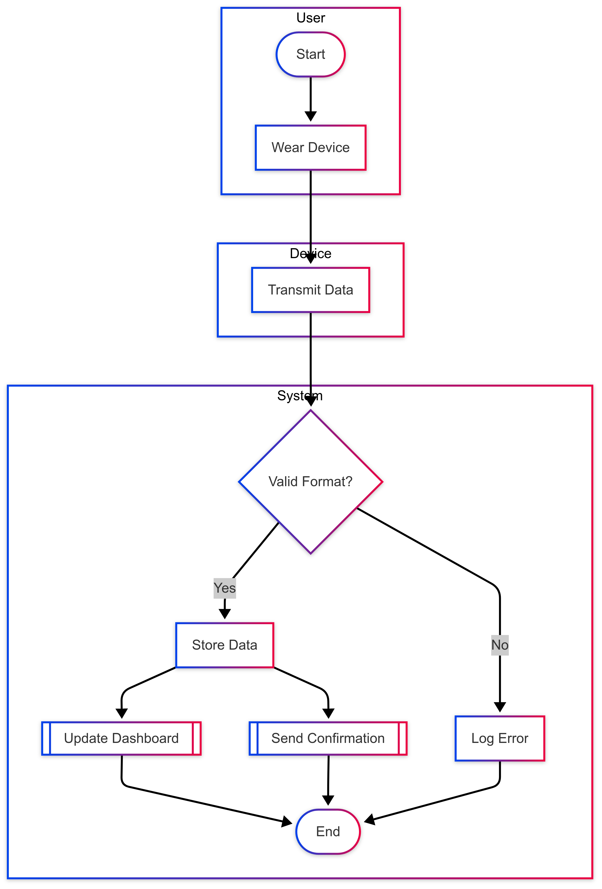
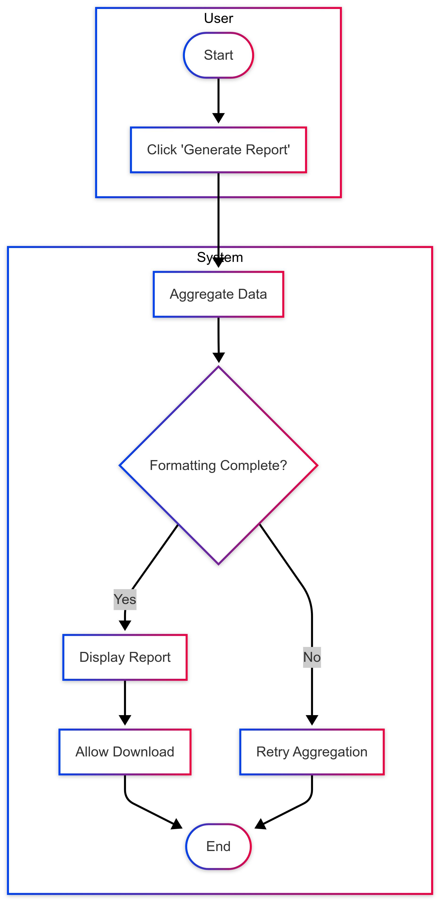
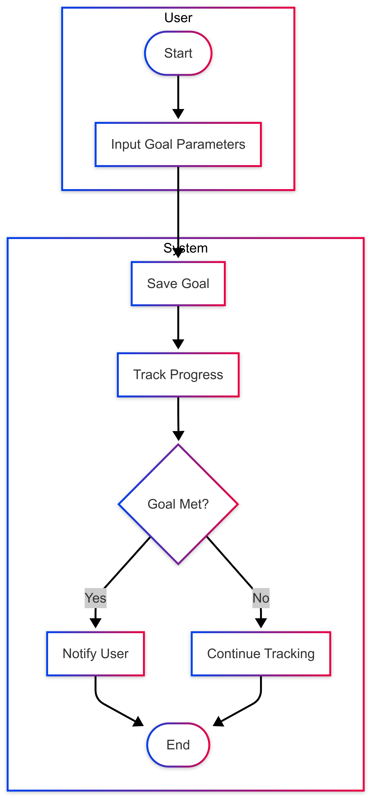
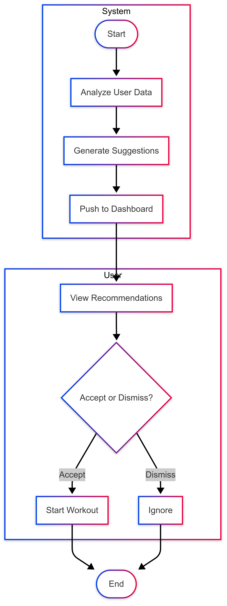
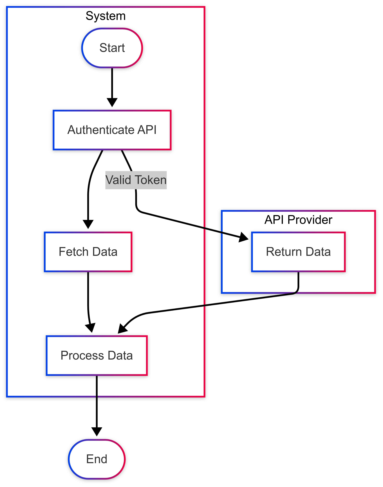
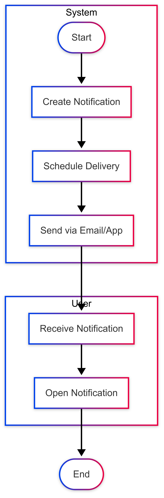
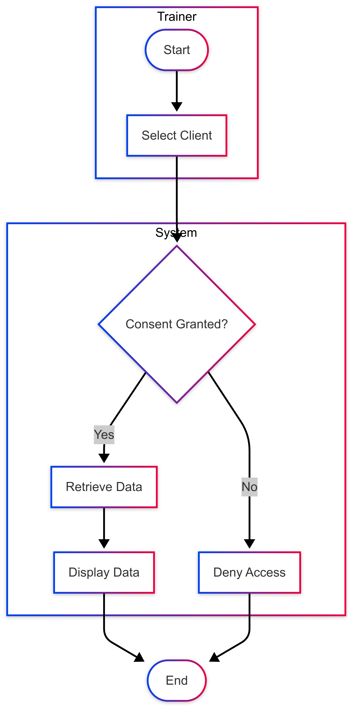

# Activity Diagram

## User Registration/Login

## User registration explainantion
|Component| Details                                                                          |
|---|----------------------------------------------------------------------------------|
|Start/End Nodes| Start: User navigates to registration page, End: Redirect to dashboard or error. |
|Actions| Enter email/password, Validate credentials, Create account.                      |
|Decisions| Validate Credentials? → Yes (valid) / No (invalid).                              |
|Parallel Actions| None                                                                             |
|Swimlanes| User: Navigate, Enter Details, System: Validate, Create Account.                 |
|Mapping to FR/NFR|                     FR-1 (secure registration), NFR-Security (credential validation).|

## Track Fitness Data

| Component | Details                                                              |
|-----------|----------------------------------------------------------------------|
|   Start/End Nodes        | Start: User wears device, End: Data stored or error logged.          |
|    Actions       | Transmit data, Validate data, Store data, Update dashboard.          |
|      Decisions     | Valid Format? → Yes (store) / No (log error).                        |
|      Parallel Actions     | Update dashboard and send confirmation.                              |
|      Swimlanes     | User: Wear device, Device: Transmit, System: Validate, Store, Update. |
|       Mapping to FR/NFR    |      FR-2 (real-time tracking), NFR-Performance (parallel updates).|

## Generate Report

|Component| Details                                                              |
|---|----------------------------------------------------------------------|
|Start/End Nodes| Start: User clicks "Generate Report", End: Report displayed or retry. |
|Actions| Aggregate data, Format report, Display/download.                     |
|Decisions| Formatting Complete? → Yes (display) / No (retry).                   |
|Parallel Actions| None                                                                 |
|Swimlanes| User: Request report, System: Aggregate, Format, Display.            |
|Mapping to FR/NFR|     FR-6 (analytics), NFR-Usability (graphical format).|

## Set and Monitor Goals

|Component| Details                                                   |
|---|-----------------------------------------------------------|
|Start/End Nodes| Start: User inputs goal, End: Continue tracking or notify. |
|Actions| Save goal, Track progress, Check achievement.             |
|Decisions| Goal Met? → Yes (notify) / No (continue).                 |
|Parallel Actions| None                                                      |
|Swimlanes| User: Input goal, System: Save, Track, Check.             |
|Mapping to FR/NFR|   FR-5 (goal monitoring), FR-9 (notifications).|
## Provide Workout Recommendations

|Component| Details                                                         |
|---|-----------------------------------------------------------------|
|Start/End Nodes| Start: System analyzes data, End: User accepts/dismisses.       |
|Actions| Analyze data, Generate suggestion, Push to dashboard.           |
|Decisions| Accept or Dismiss? → Accept (start workout) / Dismiss (ignore). |
|Parallel Actions	| None                                                            |
|Swimlanes| System: Analyze, Generate, Push, User: View, Decide.            |
|Mapping to FR/NFR	|   FR-4 (personalized recommendations), NFR-Usability (user-friendly UI).                                                              |

## Integrate Third-Party API

|Component| Details                                                          |
|---|------------------------------------------------------------------|
|Start/End Nodes| Start: System initiates API call, End: Data processed.           |
|Actions| Authenticate API, Fetch data, Process data.                      |
|Decisions| None (sequential flow).                                          |
|Parallel Actions| Authentication and data fetching (handled by different actors).  |
|Swimlanes| System: Authenticate, Fetch, Process, API Provider: Return data. |
|Mapping to FR/NFR	|     FR-7 (API integration), NFR-Deployability (cross-platform compatibility).                                                             |

## Send Notifications

|Component| Details                                                          |
|---|------------------------------------------------------------------|
|Start/End Nodes| Start: System creates notification, End: User opens notification. |
|Actions| Schedule delivery, Send notification, Receive/open.              |
|Decisions| None                                                             |
|Parallel Actions| None                                                             |
|Swimlanes| System: Create, Schedule, Send, User: Receive, Open.             |
|Mapping to FR/NFR	| FR-9 (notifications), NFR-Performance (timely delivery).|

## Access Client Data

|Component| Details                                                              |
|---|----------------------------------------------------------------------|
|Start/End Nodes| Start: Trainer selects client, End: Data displayed or access denied. |
|Actions| Verify consent, Retrieve data, Display data.                         |
|Decisions| Consent Granted? → Yes (retrieve) / No (deny).                       |
|Parallel Actions| None                                                                 |
|Swimlanes| Trainer: Select client, System: Verify, Retrieve, Display.           |
|Mapping to FR/NFR|   FR-8 (client data access), NFR-Security (consent checks).                                                                   |

## Traceability Summary
|Workflow|	FR Mapping|	NFR Mapping| 	Stakeholder Addressed   |
|---|---|---|--------------------------|
|User Registration/Login|	FR-1|	NFR-Security|	IT Staff, Fitness Enthusiast|
|Track Fitness Data|	FR-2|	NFR-Performance|	Fitness Enthusiast|
|Generate Report|	FR-6|	NFR-Usability|	Business Owner|
|Set and Monitor Goals|	FR-5, FR-9|	NFR-Performance|	Health Professional|
|Provide Workout Recommendations|	FR-4|	NFR-Usability|	Fitness Enthusiast|
|Integrate Third-Party API|	FR-7|	NFR-Deployability|	System Admin|
|Send Notifications|	FR-9|	NFR-Performance|	Fitness Enthusiast|
|Access Client Data|	FR-8|	NFR-Security|	Trainer|

