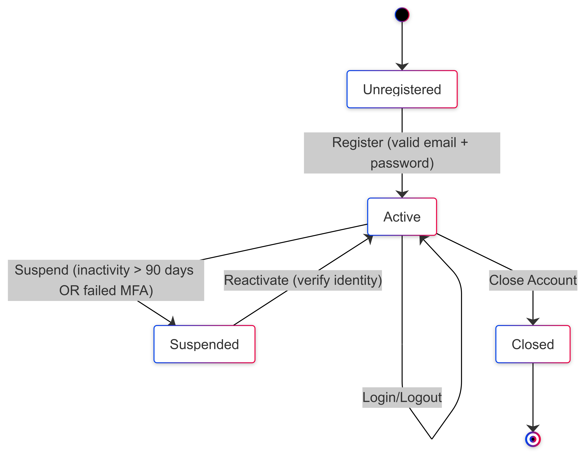
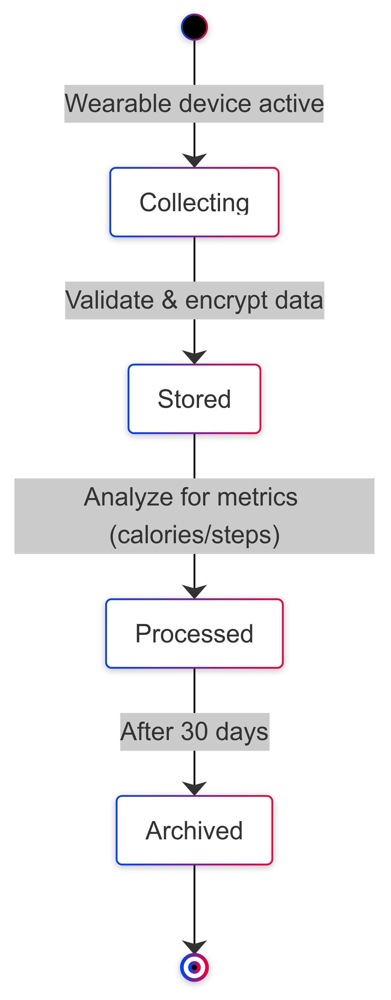
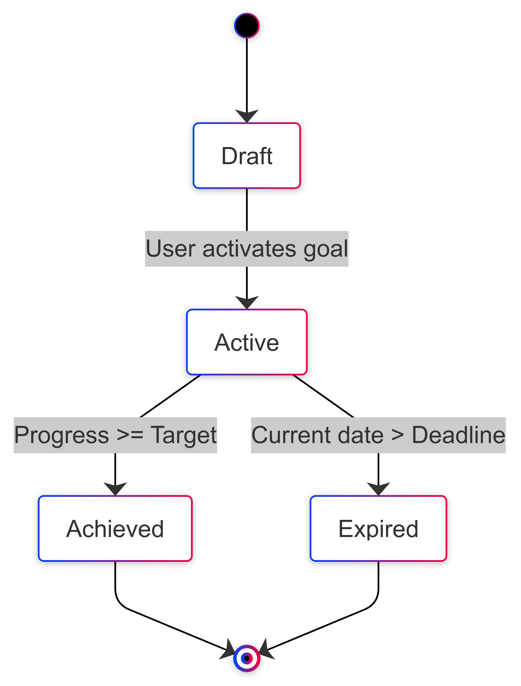
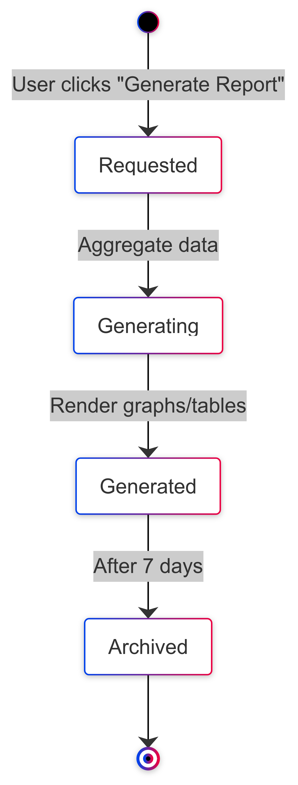
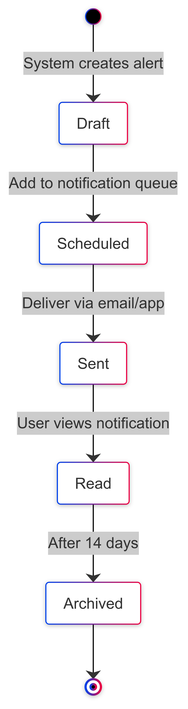
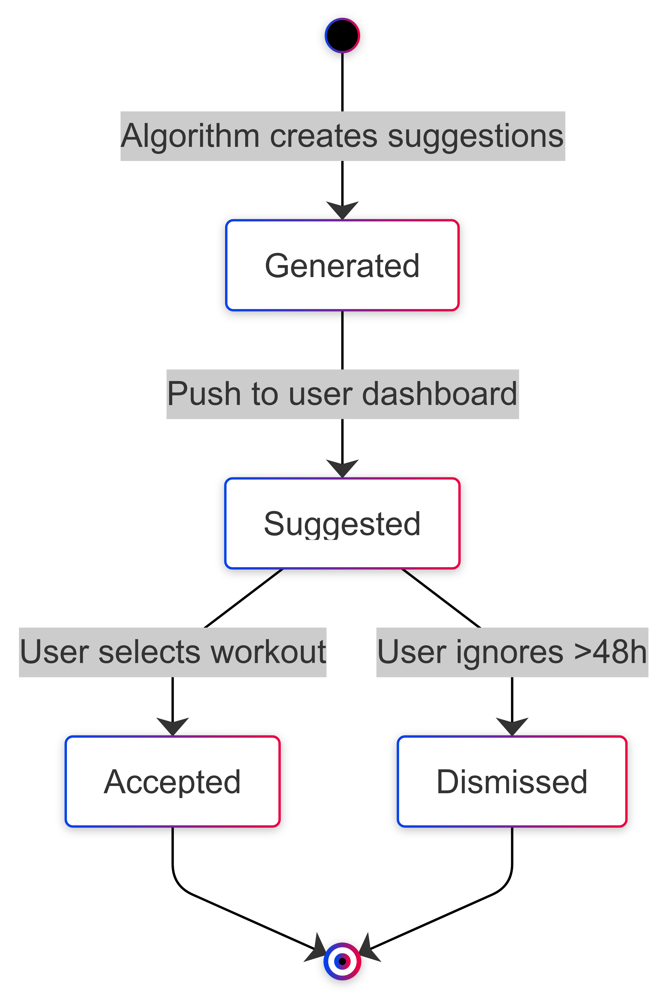
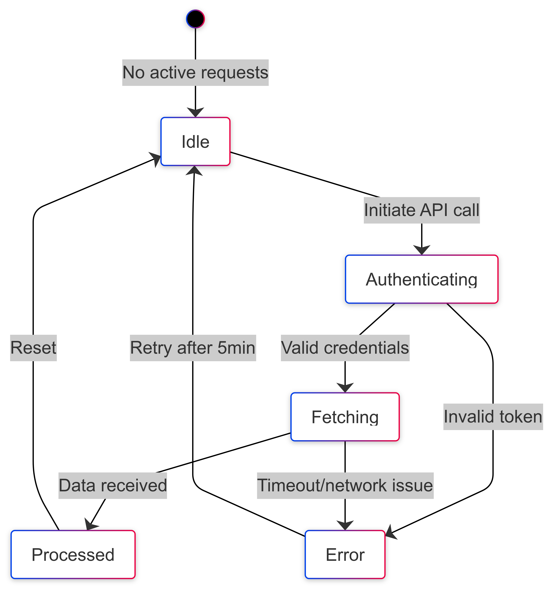
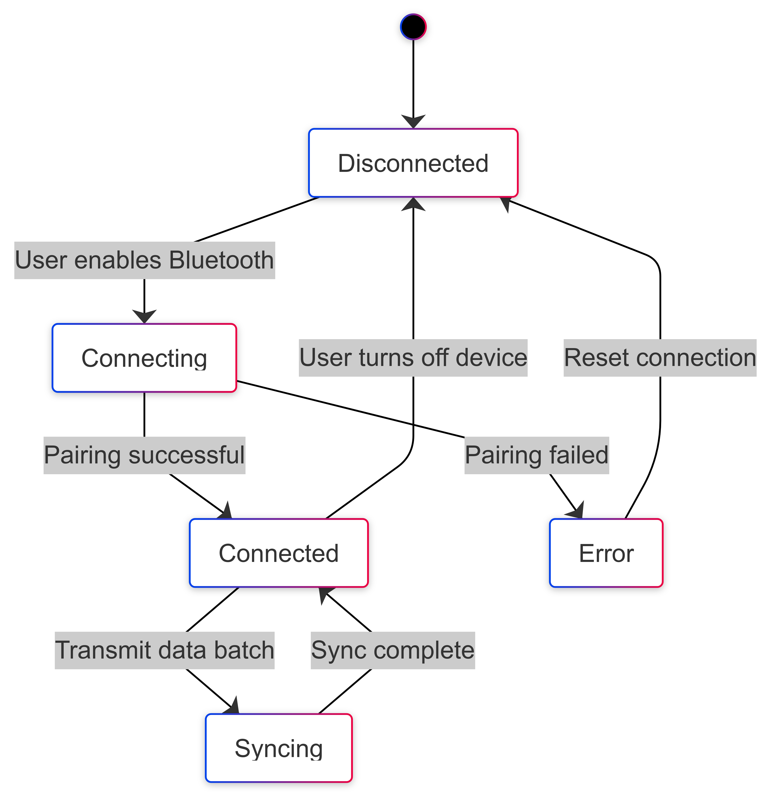

# State Transition Diagrams
___
## User_Account_Diagram

## Fitness_Data_Diagram

## Workout_Goal_Diagram

## Report_Diagram

## Notification_Diagram

## Workout_Recommendation_Diagram

## API_Integration_Diagram

## Device_Connection_Diagram

# Explaination of Transitions to Different States
___
## User Account Explanation
|From State|To State|Triggering Event|Guard Condition|
|---|---|---|---|
|Unregistered|Active|User completes registration|Valid email and password format|
|Active|Suspended|System detects inactivity/fraud|90 days of inactivity OR 3 failed logins|
|Suspended|Active|User verifies identity|Successful MFA confirmation|
|Active|Closed|User requests account deletion|No active subscriptions|

## Fitness Data Explaination
|From State|To State|Triggering Event|Guard Condition|
|---|---|---|---|
|Collecting|Stored|Device transmits data|Data passes validation (e.g., non-null)|
|Stored|Processed|System analyzes data|Metrics extraction successful|
|Processed|Archived|Retention period expires|30 days since processing|

## Workout Goal Explaination
|From State|To State|Triggering Event|Guard Condition|
|---|---|---|---|
|Draft|Active|User activates goal|Valid target (e.g., steps > 0)|
|Active|Achieved|Progress meets target|Steps >= Goal Target|
|Active|Expired|Deadline passes|Current date > Goal Deadline|

## Report Explaination
|From State|To State|Triggering Event|Guard Condition|
|---|---|---|---|
|Requested|Generating|User clicks "Generate Report"|Sufficient data available|
|Generating|Generated|System renders graphs/tables|Data aggregation successful|
|Generated|Archived|Retention period expires|7 days since generation|

## Notification Explaination
|From State|To State|Triggering Event|Guard Condition|
|---|---|---|---|
|Draft|Scheduled|System queues notification|Time matches user preferences|
|Scheduled|Sent|Notification delivery triggered|Device online|
|Sent|Read|User opens notification|None|
|Read|Archived|Retention period expires|14 days since read|

## Workout Recommendation Explaination
|From State|To State|Triggering Event|Guard Condition|
|---|---|---|---|
|Generated|Suggested|System pushes to dashboard|User hasn’t dismissed prior suggestions|
|Suggested|Accepted|User clicks "Start Workout"|None|
|Suggested|Dismissed|User ignores suggestion|48 hours since suggestion|

## API Integration Explaination
|From State|To State|Triggering Event|Guard Condition|
|---|---|---|---|
|Idle|Authenticating|System initiates API call|Valid API credentials configured|
|Authenticating|Fetching|Authentication successful|Token validation passed|
|Fetching|Processed|Data received|HTTP 200 response|
|Fetching|Error|Network timeout|No response after 10s|
|Error|Idle|Retry mechanism triggers|5 minutes since last attempt|

## Device Connection Explaination
|From State|To State|Triggering Event|Guard Condition|
|---|---|---|---|
|Disconnected|Connecting|User enables Bluetooth|Device in pairing mode|
|Connecting|Connected|Pairing successful|Valid device ID|
|Connected|Syncing|Data transmission starts|Device battery > 10%|
|Syncing|Connected|Sync completes|Data validated|
|Connecting|Error|Pairing failed|Invalid device/Bluetooth off|
|Error|Disconnected|User resets connection|None|