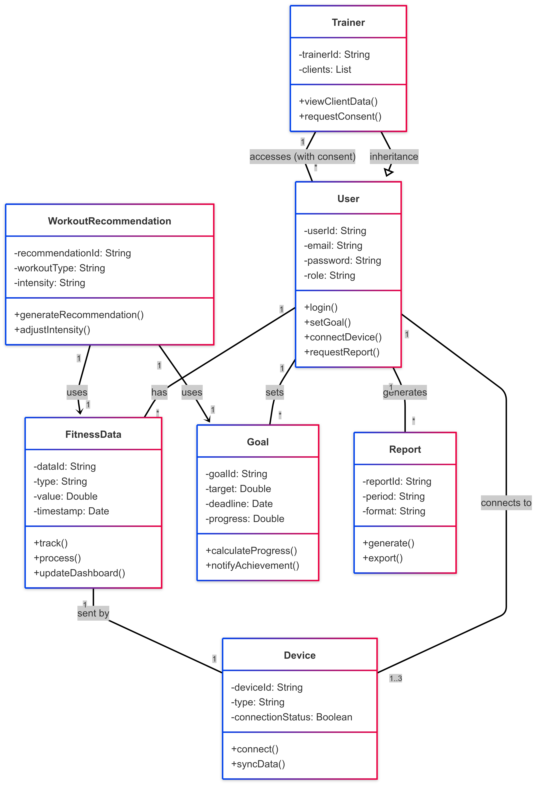

# Key Domain Entities

|Entity|Attributes|Methods|Relationships| Business Rules                                                                                                                                                                             |
|---|----------|-------|-------------|--------------------------------------------------------------------------------------------------------------------------------------------------------------------------------------------|
|User| <li> userId: String </li> <li>email: String </li> <li> password: String </li> <li> role: String (e.g."FitnessEnthusiast", "Trainer") </li> | <li>+login()</li><li>+setGoal()</li><li>+connectDevice()</li><li>+requestReport()</li> | <li>Associated with Goal (1..)</li><li>Associated with FitnessData (1..)</li><li>Associated with Report (1..*)</li> | <li>A user can connect up to 3 devices</li> <li>Multi-factor authentication is enforced</li> <li>A user must authenticate via OAuth 2.0 before accessing dashboard features</li> <li>A user can only view fitness metrics if they have connected a wearable device</li> |
|FitnessData| <li>dataId: String</li> <li>type: String (e.g., "steps", "calories")</li> <li>value: Double</li> <li>timestamp: Date</li> | <li>+track()</li><li>+process()</li> <li>+updateDashboard()</li> | <li>Associated with Device (1)</li> <li>Used by WorkoutRecommendation (1)</li> | <li>Data updates on the dashboard within 5 seconds</li> <li>Historical data is stored for 2 years</li>                                                                                     |
|Goal| <li>goalId: String</li> <li>target: Double</li> <li>deadline: Date</li> <li>progress: Double</li> | <li>+calculateProgress()</li><li>+notifyAchievement()</li> |         <li>Owned by User (1)</li> | <li>A user can have up to 5 active goals.</li>                                                                                                                                             |
|WorkoutRecommendation| <li>recommendationId: String</li> <li>workoutType: String</li> <li>intensity: String</li> | <li>+ generateRecommendation()</li> <li>+ adjustIntensity()</li> |     <li>Depends on FitnessData (1)</li> <li>Depends on Goal (1)</li> | <li>Recommendations must refresh daily</li>                                                                                                                                                |
|Report| <li>reportId: String</li> <li>period: String (e.g., "weekly")</li> <li>format: String (e.g., "graphical")</li> | <li>+ generate()</li> <li>+ export()</li> |         <li>Generated by User (1)</li> | <li>Reports are auto-generated every Monday</li>                                                                                                                                           |
|Device| <li>deviceId: String</li> <li>type: String (e.g., "wearable")</li> <li>connectionStatus: Boolean</li> | <li>+connect()</li> <li>+syncData()</li> |        <li>Linked to User (1)</li> | <li>Only compatible devices can connect</li>                                                                                                                                               |
|Trainer| <li>trainerId: String</li> <li>clients: List<User></li> | <li>+viewClientData()</li> <li>+requestConsent()</li> |       <li>Inherits from User</li> <li>Accesses User (with consent)</li> | <li>Trainers can only view data with explicit client consent</li>                                                                                                                          |

# Class Diagram in Mermaid.js

