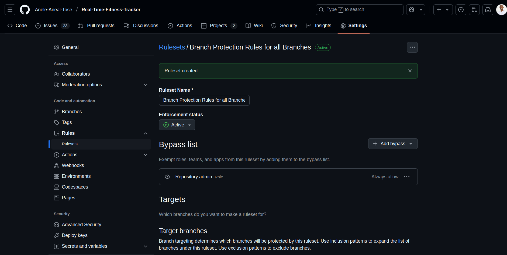
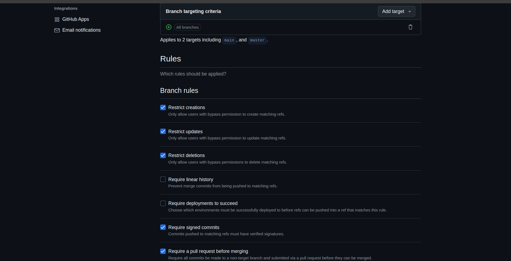
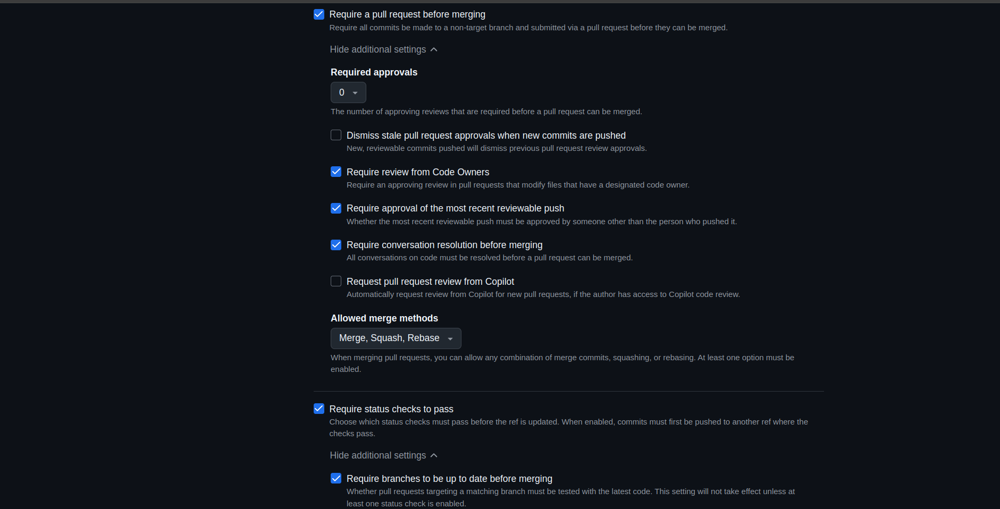
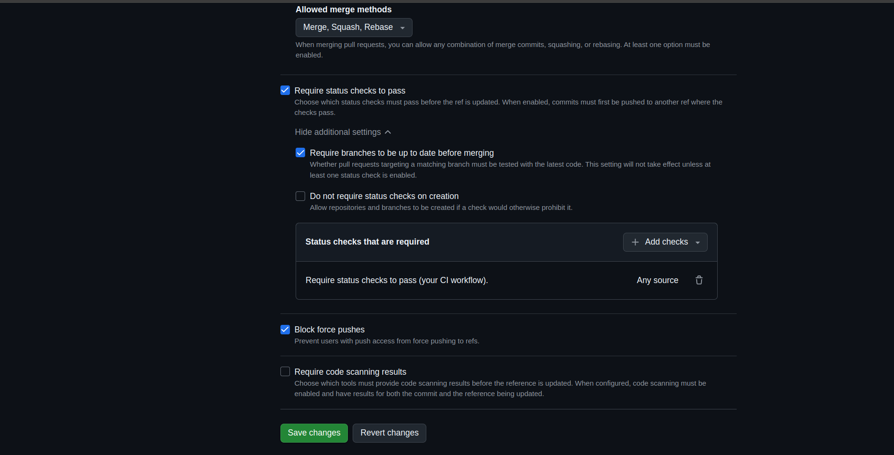

# Branch Protection Rules

To maintain code quality and prevent bugs from entering the `main` branch, we enforce:

- Pull Request reviews to ensure peer validation.
- Mandatory status checks (CI tests must pass).
- No direct commits to `main`; all changes go through PRs.
- Up-to-date branches before merge to avoid conflicts.

These rules reflect industry best practices and ensure team accountability and automated quality control.

## Screenshot of the GitHub Branch Protection Rules

