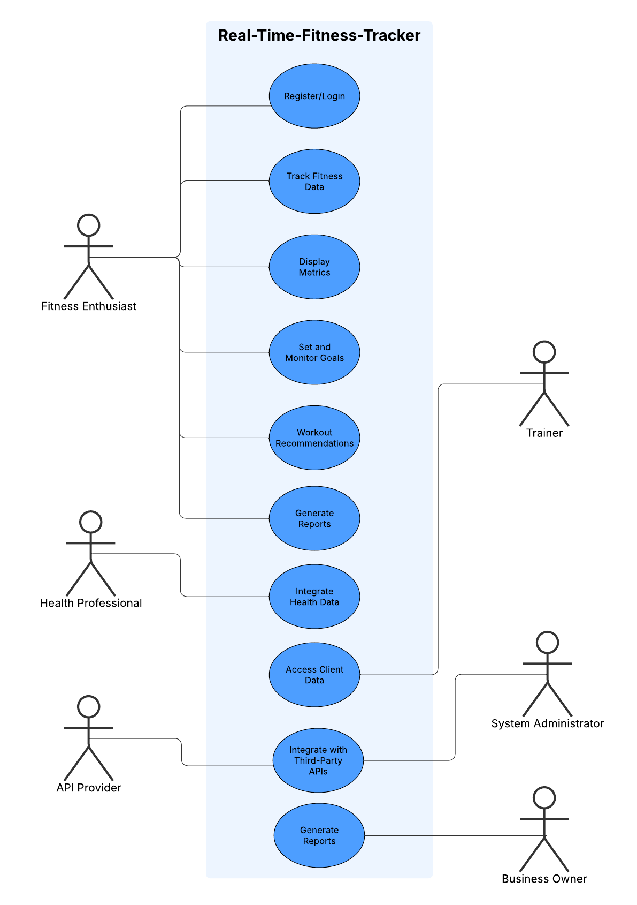

# Use Case Diagram
___

___

## Explanation of the Diagram:

### Actors:
* Fitness Enthusiast: The primary user who interacts with the system to track fitness data, set goals, and receive recommendations.
* Trainer: Accesses client fitness data to provide guidance.
* Health Professional: Integrates health data for medical recommendations.
* System Admin: Maintains system uptime and security.
* Business Owner: Monitors user engagement and revenue generation.
* API Provider: Provides real-time health and fitness data.

### Use Cases:
* User Authentication: Allows users to register and log in securely.
* Real-Time Fitness Tracking: Tracks fitness data from wearable devices.
* Display Fitness Metrics: Displays fitness metrics on web and mobile apps.
* Goal Setting & Monitoring: Allows users to set and monitor fitness goals.
* Personalized Workout Recommendations: Provides workout recommendations based on user activity.
* Analytics & Progress Reports: Generates analytics and progress reports.
* Notifications & Insights: Notifies users of goal achievements and fitness insights.
* Client Data Access: Allows trainers to access client fitness data.
* Health Data Integration: Integrates with third-party health data APIs.
* System Maintenance: Ensures system reliability and security.
* User Engagement Monitoring: Tracks user engagement for business owners.
* API Data Integration: Provides real-time health and fitness data.

### Addressing Stakeholders Concerns

This diagram addresses stakeholder concerns from Assignment 4 by clearly mapping which 
actors interact with which system functionalities, ensuring that user requirements 
(like real-time data and personalized recommendations) and system constraints 
(such as secure integration with APIs) are modeled effectively.
